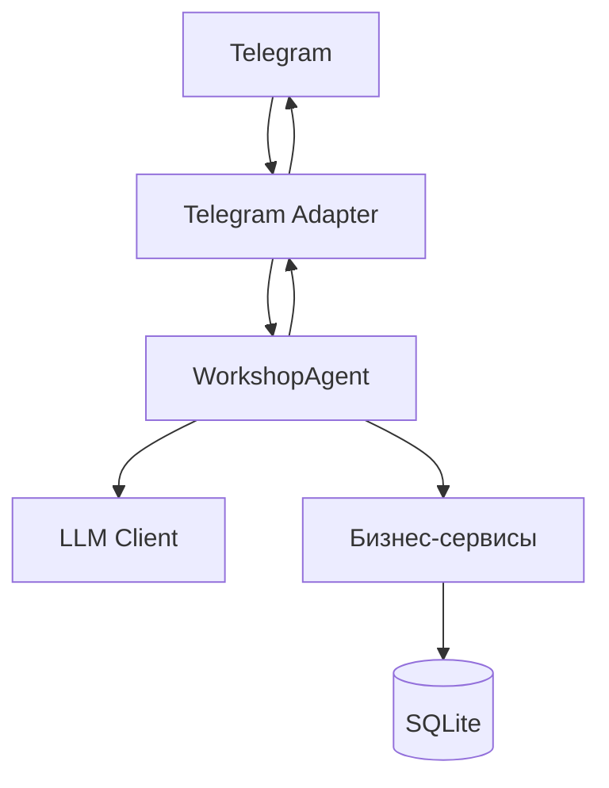

# WorkshopAgent

WorkshopAgent — это AI-ассистент на Go для небольшого производственного цеха. Он использует Telegram как клиентский слой, отдельный сервис домена WorkshopAgent для интерпретации намерений пользователя и SQLite для всех реальных данных по складу, спецификациям BOM, производству и отгрузкам.

## Архитектура

## Основные принципы

- LLM используется только для разбора естественного языка и создания структурированных действий.
- SQLite является источником истины для всех данных по складу, BOM, остаткам и движениям.
- Бизнес-правила реализованы в Go и хранятся в SQLite.
- Данные для нескольких арендаторов изолированы по workshop_id.
- Каждая операция записи должна требовать подтверждения в реальном сценарии бота.

## Статус проекта

Этот репозиторий является базой MVP для запрошенной архитектуры. В него входят Go-модуль, слой данных на SQLite, модель workshops/users, логика материалов и продуктов, рекурсивный расчёт BOM и поток WorkshopAgent на базе MockLLM.

Проект специально структурирован так, чтобы Telegram-адаптер, LLM-клиент и бизнес-сервисы можно было расширить до полноценного ERP-процесса, описанного в спецификации.

## Запуск

1. Скопируйте `.env.example` в `.env` и заполните секреты.
2. Запустите:
   - `go mod tidy`
   - `go test ./...`
    - `go run ./cmd/workshop-agent setup` — создать и проверить все таблицы SQLite.
    - `go run ./cmd/workshop-agent` — запустить Telegram-бота.

Команда `setup` безопасна для повторного запуска: она не удаляет существующие данные.

### Настройка через Telegram

После запуска бота отправьте в чат:

- `/setup` — создать/проверить таблицы и показать текущие материалы и продукты.
- `/setup_add_material` — пошагово добавить материал с выбором категории и единицы измерения.
- `/setup_add_product` — пошагово добавить продукт с выбором типа.
- `/to_order` — показать материалы, достигшие минимального остатка, и рекомендуемое количество к заказу.
- `/setup_stop` — остановить режим настройки без удаления данных.

Для остановки самого бота используйте `Ctrl+C` в окне PowerShell.

### Свободные вопросы в Telegram

Обычный текст без слеша обрабатывается через настроенную LLM. Например:

- `Сколько сейчас гипса на складе?`
- `Что нужно заказать?`
- `Какие материалы заканчиваются?`
- `Сколько товара Stitch осталось?`

LLM определяет намерение и извлекает название материала или продукта, а остатки и закупка рассчитываются Go по данным SQLite. Команды `/materials`, `/stock` и `/to_order` работают напрямую и не используют LLM.

## Переменные окружения

- `TELEGRAM_BOT_TOKEN` — токен Telegram-бота.
- `LLM_API_KEY` — API-ключ для совместимого с OpenAI endpoint.
- `LLM_BASE_URL` — базовый URL провайдера LLM.
- `LLM_MODEL` — имя модели.
- `DATABASE_PATH` — путь к локальной базе SQLite внутри проекта; по умолчанию используется `./data/workshop.db`.

> База данных хранится локально в проекте: по умолчанию используется `./data/workshop.db`. Не указывайте системные/внешние пути, если хотите держать данные в репозитории и локально на машине.

## Заметки

В этом репозитории в настоящее время есть mock-реализация LLM для тестов и локальной разработки. Для продакшена можно заменить её совместимым с OpenAI клиентом без изменения границы WorkshopAgent.
